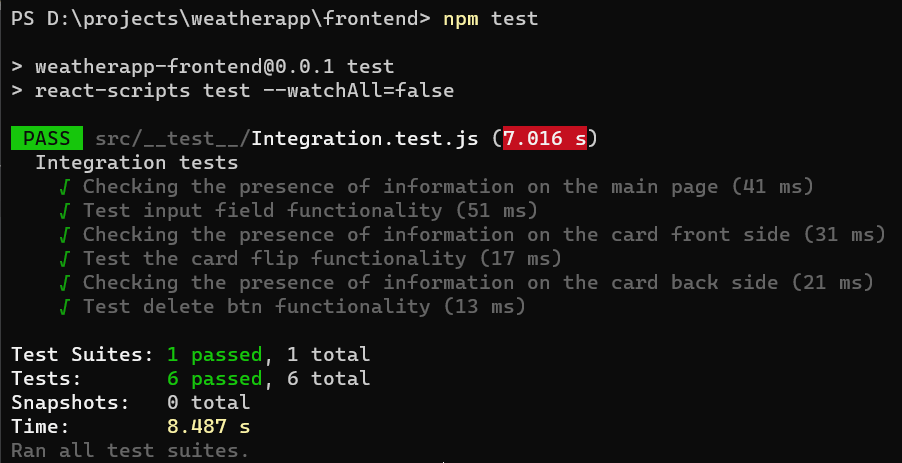
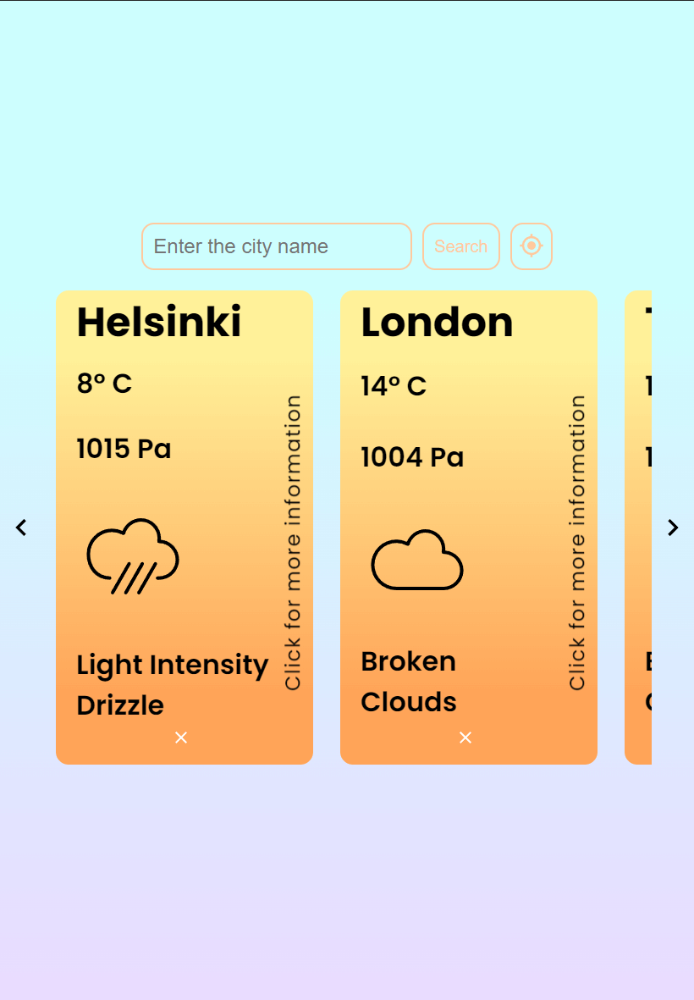

# Dmitry Sinyavskiy Weather App for Eficode

## Installation

### Docker

1. Download and install `Docker` app from official website

```sh
https://docs.docker.com/get-docker/
```

2. Clone project or download the zip from git (unzip if needed)

3. Run this command in a terminal, in the root folder where the file `docker-compose.yml` is located

```sh
docker-compose up -d
```

4. When all packages are downloaded and installed, the application will run on the ports:

   - `Backend` http://localhost:9000
   - `Frontend` http://localhost:8000

### NPM

1. You also can run the application manually via `npm`

   Run this command in the terminal to be sure that you have an `npm` installed on your device

```sh
npm -v
```

2. Now you need to install `npm` packages for the project

   Run this command in the `./frontend` and `./backend` folders

```sh
npm install
```

3. When all is done you can run the application with running this command. Do it in different terminals

```sh
npm start
```

4. Application will run on the ports:

   - `Backend` http://localhost:9000
   - `Frontend` http://localhost:8000

## Functionalities and Usage

- Enter the city name to add it to the list of cities or click on location button to add city by your geolocation


- You can add infinite number of cities

- Click "close button" on the bottom to delete city from the list


- If you click on the card, it will turn and you will see more information about city's weather


- If you will try to add city that is already in the list or try to add a non-existent city, you will get an error message


- All cities are stored in browser's `local storage`, if you will refresh the page all cities will reappear

- React application support `hot reload`, every time you update/change a react component, all changes will appear in the browser (with slight delay +-2 sec)

## Testing

- When you run an application via `Docker`, every time at container load or start-up `backend` and `frontend` tests will run automatically


- If you want to run test manually, open folder `./backend` or `./frontend` and run this command in a terminal, in the root folder where the file `package.json` is located

```sh
npm test
```




## Device support

- The application also available for mobile devices

- `Tablets`



- `Phones`


